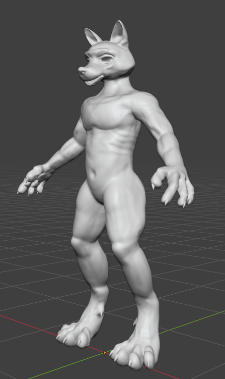
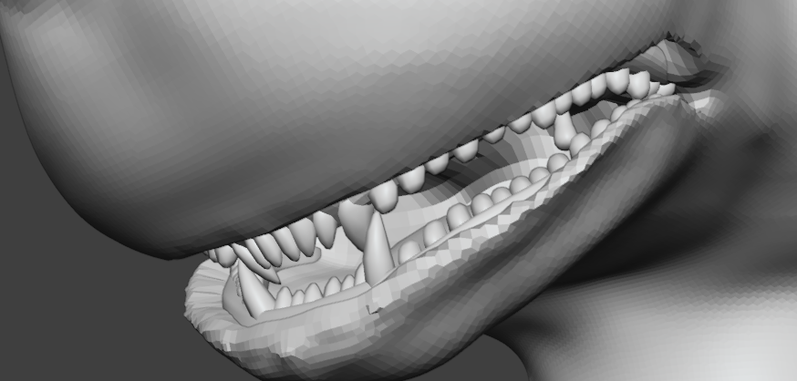
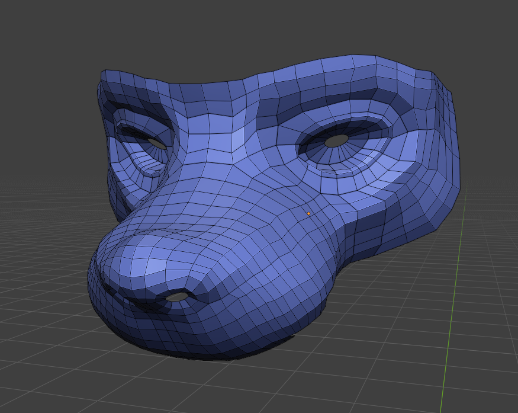
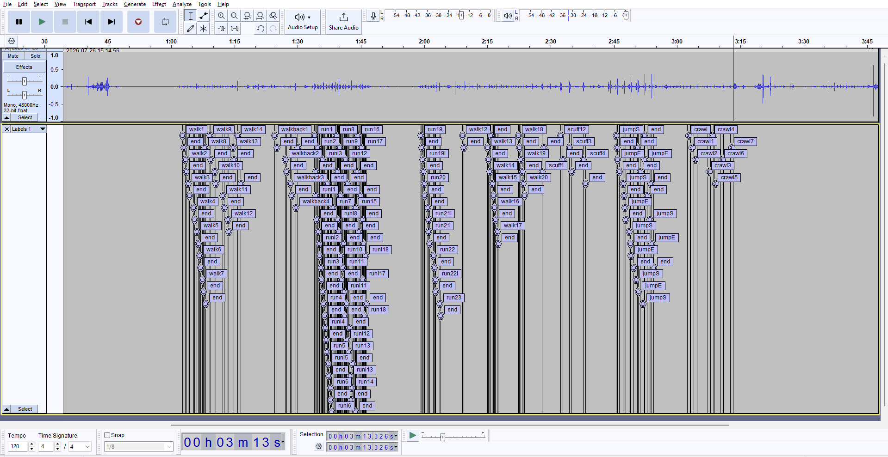

7.26.2026
### Added
* **SFX:** Recorded and split **93 concrete footstep sounds**.
* **SFX:** Recorded wood footstep sounds.

### Improved
* No improvements were made this time.

### Upcoming
* Transitioning from custom MetaHuman characters to f**ully custom-made models**. Decided to make **Foxborn** first.

### In Progress
* Finish retopology
* Texture character.
* Add hair cards for fur.
* Retarget character's skeleton to UE4 Mannequin.
* Add blendshapes (morph targets) for deep character customization.

---

<b>Click to view Foxborn's concept sheets</b>

   
  
  
Canine Base / Foxborn Sculpt

    
  

Canine mouth

    
  
  
Quite good grid for now

   

<b>Click to view screenshot from Audacity :p</b>

   
  
  
Split concrete footsteps audio samples

    

