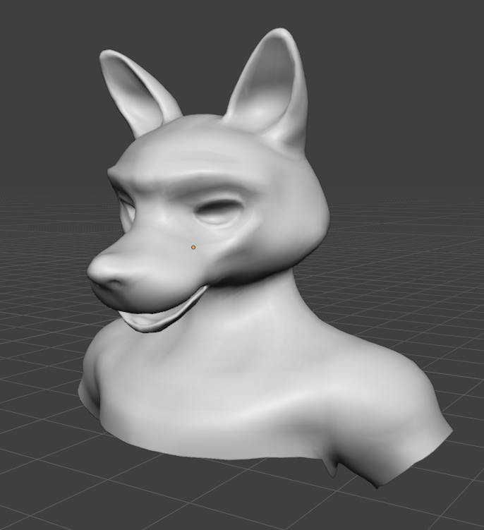

07.29.2026

### Added
* Added recorded footstep sounds into the project.

### Improved
* Improved retopology grid quality
* Improved footstep sound quality via `Metasound Presets & Patches`

### Upcoming
* Transitioning from custom MetaHuman characters to **fully custom-made models**

### In progress
* Finish retopology
* Texture character.
* Add hair cards for fur.
* Retarget character's skeleton to UE4 Mannequin.
* Add blendshapes (morph targets) for deep character customization.

---

<b>Click to view Foxborn's retopology progress</b>

   
  
  
Finished Foxborn's head retopology

    

